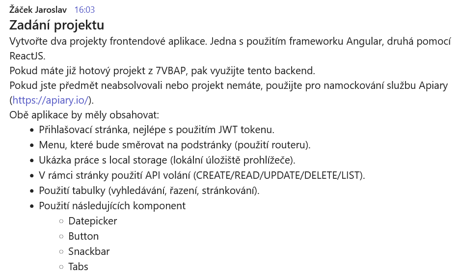

  

<h1 align="center">LIFTLOG</h1>

## Assignment

## Assignment 

- ✅ Create ReactJS, Angular + Vue
- ✅ LiftLog-BE is new backend running on GO

### REACTJS
- ✅ Loginpage with jwt
- ✅ Menu routing (dom-router)
- ✅ localstorage
- ❌ use of table pagination ext
- ❌ date picker
- ✅ button
- ✅ snackbar
- ✅ tabs

### ANGULAR
- ❌ Loginpage with jwt
- ❌ Menu routing (dom-router)
- ❌ localstorage
- ❌ use of table pagination ext
- ❌ date picker
- ❌ button
- ❌ snackbar
- ❌ tabs

### VUE
- ❌ Loginpage with jwt
- ❌ Menu routing (dom-router)
- ❌ localstorage
- ❌ use of table pagination ext
- ❌ date picker
- ❌ button
- ❌ snackbar
- ❌ tabs